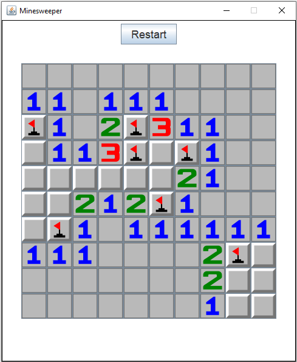
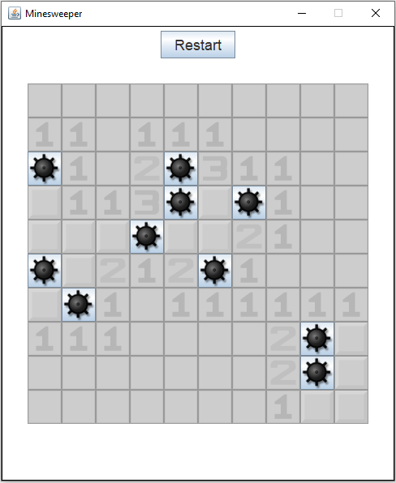
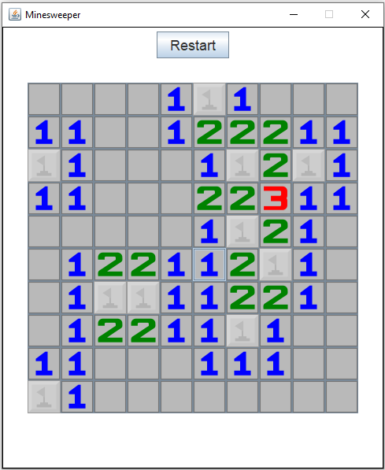

# Minesweeper

## Introduction
This project was built using __Java__ and Eclipse IDE and consists on the classic Minesweeper game 

## Key Concepts
* Object Oriented Programming (OOP)
* GUI Widget Toolkit
    * Swing
    * Abstract Window Toolkit (AWT)

## Screenshots
### Mid Play

### Lose

### Win

## How to run
Clone or download this project, open it using Eclipse IDE and click Run.